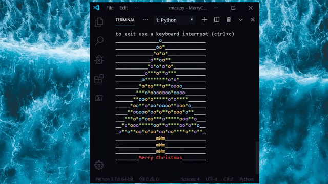

# MerryChristmas

A Python christmas tree in the terminal.

Inspired by [ChristBASHTree](https://github.com/sergiolepore/ChristBASHTree/blob/master/tree-EN.sh)

## TODO

- borders
- argparse to make a command line application
